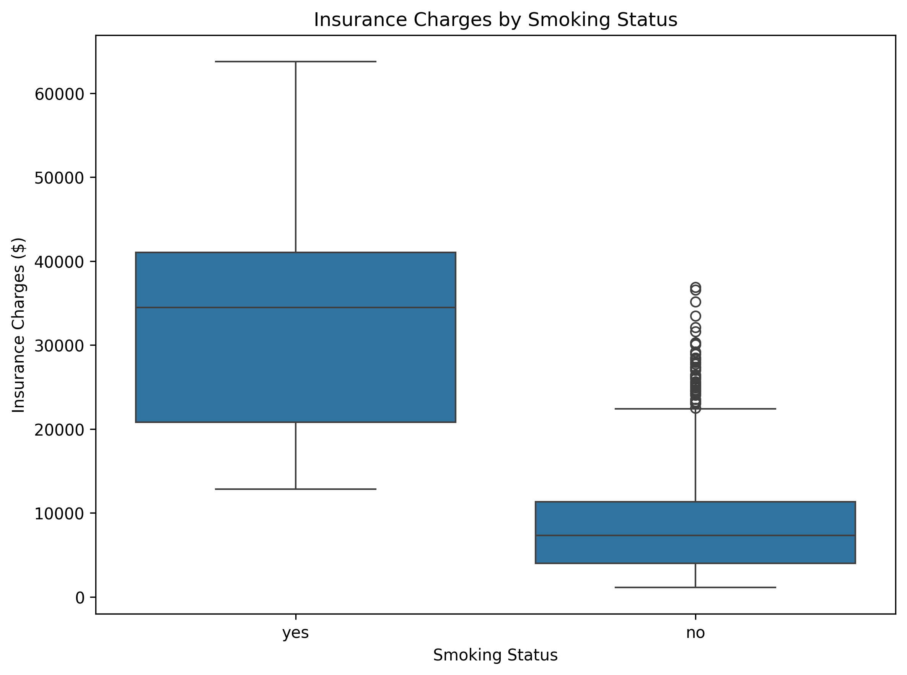
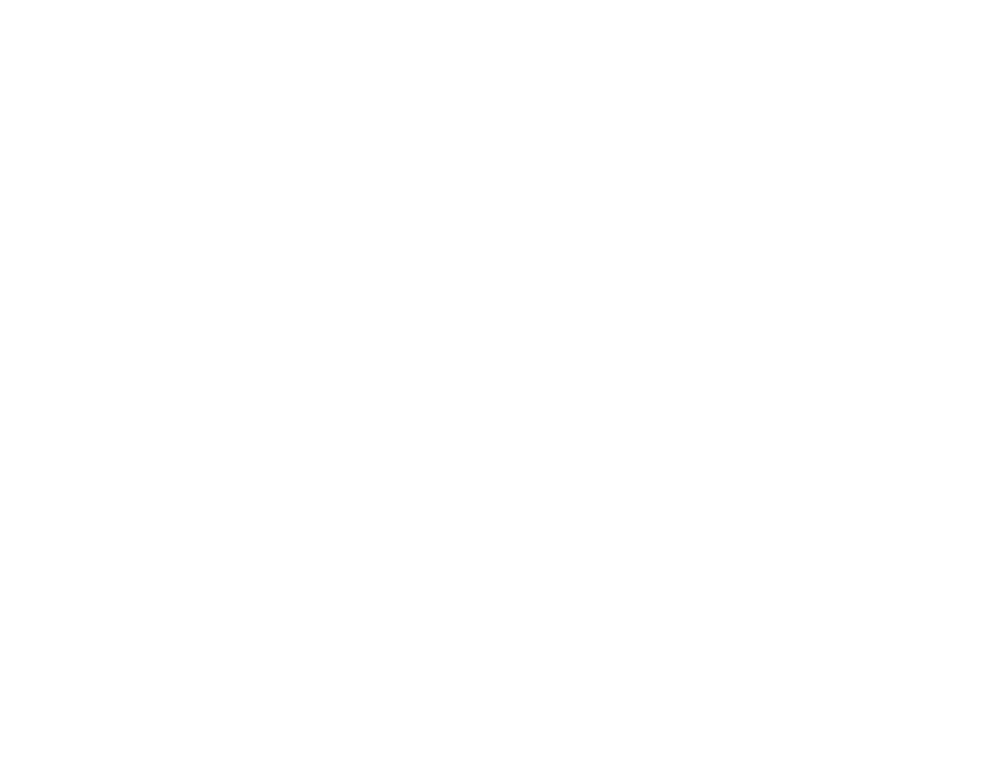
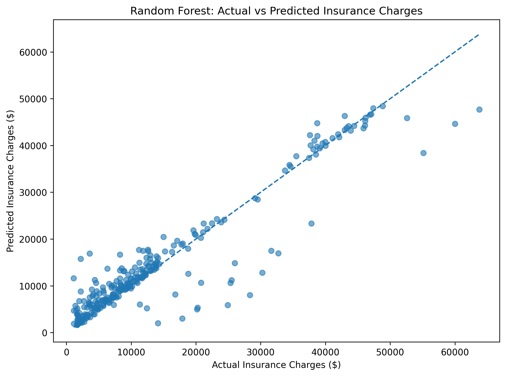
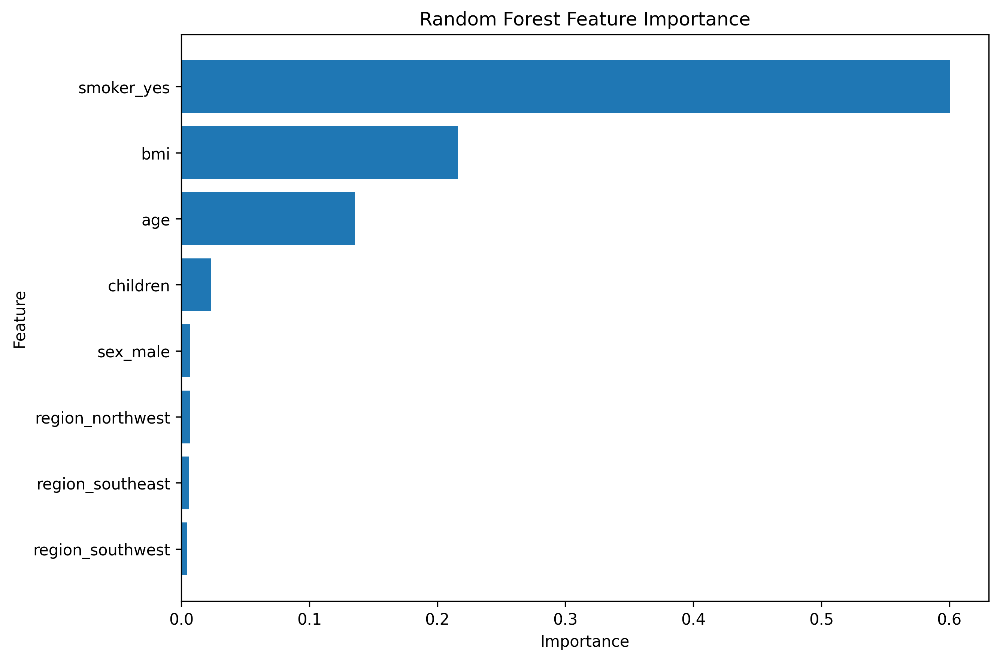

# Medical Insurance Cost Prediction Using Machine Learning

## Project Overview

This data science project explores and predicts medical insurance charges using demographic and lifestyle characteristics.

The project applies exploratory data analysis (EDA), data preprocessing, feature engineering, regression modeling, model evaluation, and cross-validation.

Two machine learning algorithms were evaluated:

- Linear Regression
- Random Forest Regression

Based on the evaluation results obtained in this project, Random Forest Regression produced stronger predictive performance and was selected as the final model.

## Project Objectives

The objectives of this project are to:

- Explore factors associated with medical insurance charges.
- Prepare categorical and numerical variables for machine learning.
- Build regression models for predicting insurance charges.
- Compare Linear Regression and Random Forest Regression.
- Evaluate model performance using MAE, RMSE, R², and 5-fold cross-validation.
- Apply the selected model to new data.

## Dataset

The dataset contains the following variables:

| Variable | Description |
|---|---|
| age | Age of the individual |
| sex | Sex of the individual |
| bmi | Body Mass Index |
| children | Number of dependent children |
| smoker | Smoking status |
| region | Residential region |
| charges | Medical insurance charges |

The cleaned dataset is stored in:

`data/medical_insurance_cleaned.csv`

## Technologies Used

- Python
- Jupyter Notebook
- Pandas
- NumPy
- Matplotlib
- Seaborn
- Scikit-learn

## Project Workflow

1. Data loading and inspection
2. Data cleaning
3. Exploratory Data Analysis
4. Feature engineering
5. Categorical variable encoding
6. Train-test split
7. Linear Regression
8. Random Forest Regression
9. Model evaluation
10. 5-fold cross-validation
11. Model comparison and selection
12. Prediction on new data

## Exploratory Data Analysis

### Insurance Charges by Smoking Status

The exploratory analysis showed a substantial difference in the distribution of insurance charges between smokers and non-smokers.

## Model Results

| Model | MAE | RMSE | Test R² | Mean CV R² |
|---|---:|---:|---:|---:|
| Linear Regression | $4,177.05 | $5,956.34 | 0.8069 | 0.7467 |
| Random Forest | $2,631.95 | $4,696.32 | 0.8800 | 0.8362 |

Based on these evaluation metrics, Random Forest produced stronger predictive results on this dataset.

## Model Performance Comparison

## Actual vs Predicted Charges

## Feature Importance

The Random Forest feature-importance analysis indicated that smoking status was the most influential feature in the fitted model, followed by BMI and age.

Feature importance should not be interpreted as evidence of causation.

## Example Prediction

The final Random Forest model was applied to a hypothetical individual with the following characteristics:

- Age: 40 years
- Sex: Male
- BMI: 30.5
- Children: 2
- Smoking status: Non-smoker
- Region: Southeast

The predicted insurance charge was approximately **$11,017.25**.

This prediction is a model estimate based on patterns in the dataset and is not a guaranteed insurance cost.

## Key Findings

- Smoking status was the strongest feature in the fitted Random Forest model.
- BMI and age were also important predictive features.
- Random Forest produced stronger predictive results than Linear Regression on this dataset.
- Cross-validation supported the overall model comparison observed on the test data.

## Limitations

- The analysis is based on the variables available in the dataset.
- Other factors that may influence real-world insurance costs are not represented.
- Feature importance does not establish causal relationships.
- Performance on this dataset does not guarantee equivalent performance on external data.
- External validation would be required before real-world application.

## How to Run the Project

1. Clone or download this repository.
2. Install the required packages using `pip install -r requirements.txt`.
3. Open `CapstoneProject.ipynb` in Jupyter Notebook.
4. Run the notebook cells from top to bottom.

## Conclusion

This project demonstrates an end-to-end machine learning workflow for predicting medical insurance charges. Linear Regression provided an interpretable baseline, while Random Forest achieved stronger predictive performance on the evaluation metrics used in this analysis.

## Author

**Chukwuemeka Emmanuel Udeh**

Data Analytics & Machine Learning Portfolio Project
